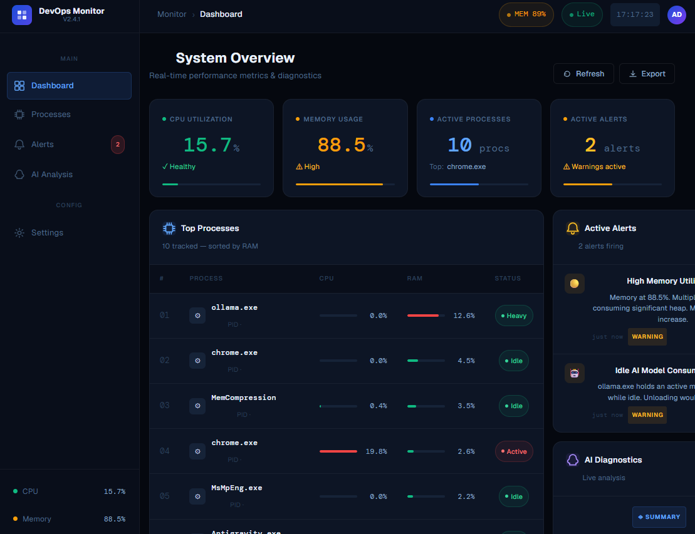
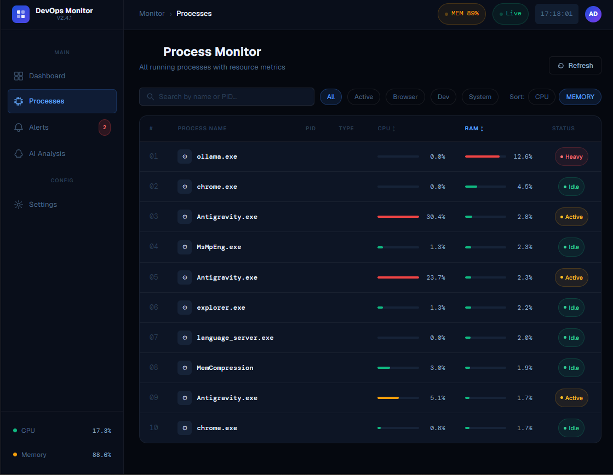
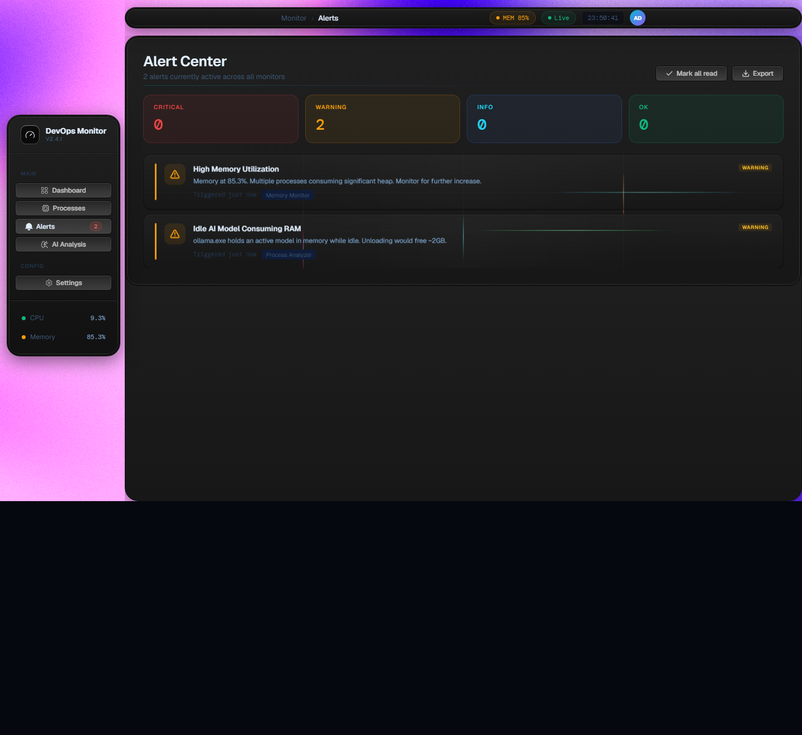
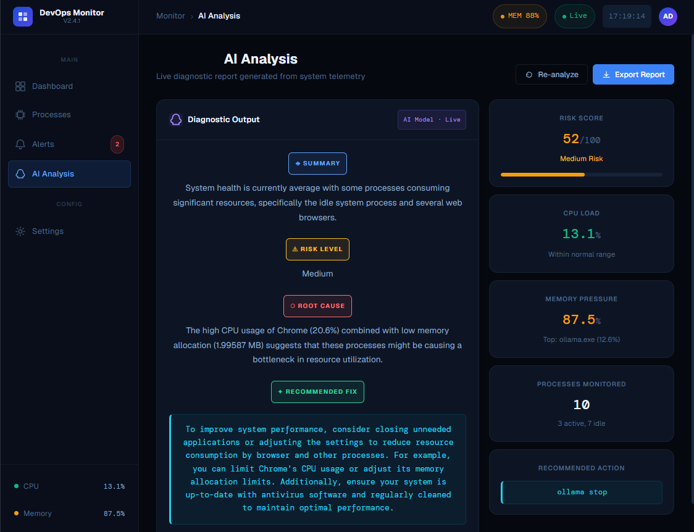

# AI DevOps Monitor

A local system monitoring platform with real-time telemetry and AI analysis. It runs fully on your laptop.

## System Architecture

* **Data Collector:** psutil (Windows OS)
* **Backend:** FastAPI
* **Real-time Streams:** WebSockets
* **Frontend Dashboard:** React
* **AI Engine:** Ollama LLM (Qwen 2.5 1.5B)

## Screenshots

### Main Dashboard

### Process Monitor

### Alert Center

### AI Analysis

## Key Features

### 1. Real-Time Telemetry & Process Intelligence
The system uses WebSockets to stream live data:
* **/ws/metrics**: Tracks CPU usage, memory usage, and timestamp for live system health tracking.
* **/ws/processes**: Tracks process name, CPU usage, and memory usage. It ranks and sorts the top 5 processes based on a weighted score (CPU + memory) to detect heavy applications.

### 2. AI Reasoning Layer
* **/ws/ai**: Collects CPU and memory history, computes averages, extracts top processes, and sends a prompt to the local Qwen model. It returns an analysis to the frontend to explain the system state in natural language and generate recommendations.
* Uses **qwen2.5:1.5b** locally via Ollama with no cloud dependencies.

### 3. Interactive React Dashboard
A live dashboard displaying:
* System metrics (CPU %, Memory %)
* Process list (top memory & CPU consumers)
* AI panel (system summary, risk level, recommendations)

### 4. Alert & Scoring System
* Triggers warnings on the frontend when CPU or Memory exceeds thresholds.
* The AI contributes a risk score (0-100) and powers the recommendation engine.
* Process ranking logic: `score = cpu * 0.6 + memory * 0.4`
* Risk score logic: `risk_score = CPU impact + Memory impact + top process impact`

### 5. Secure Local Traffic
* Enabled HTTPS with OpenSSL self-signed certificates.
* Uvicorn runs a secure server resulting in encrypted local traffic and secure WebSocket upgrades (wss).

## Core Design Decisions

1. **Metric Collection:** Uses `psutil` for direct OS access to CPU/memory metrics without external agents, ensuring offline functionality and low setup cost.
2. **Time Series History:** Keeps a short-term in-memory buffer (last 5 entries) of system snapshots. This reduces memory usage while smoothing out sudden spikes.
3. **Rolling Averages:** Averages the history buffer to remove noise, avoid false alerts, and stabilize the input for the AI model.
4. **Process Scoring & Sorting:** Processes are ranked using a weighted formula (`score = CPU * 0.6 + Memory * 0.4`). This prioritizes CPU spikes (which usually cause lag) while still accounting for persistent memory leaks. The top 5 heavy processes are extracted for analysis.
5. **Structured AI Prompts:** The AI receives a structured prompt containing CPU/Memory averages and the top processes. This ensures consistent responses, easier pattern recognition, and stable outputs.
6. **AI Decision Layer:** The local LLM interprets the raw metrics to provide a human-readable system summary, risk level (0-30: low, 30-70: medium, 70+: high), root causes, and actionable fix suggestions without hardcoding rules.
7. **WebSocket Streaming:** Uses WebSockets for real-time updates without polling overhead, providing a continuous data feed to the frontend.
8. **In-Memory Storage:** The system avoids a persistent database to remain lightweight, fast, and simple. The trade-off is that historical data is lost on restart.

## Real-time Behavior
* **Every cycle:** The backend collects system stats and sends WebSocket updates. The frontend renders the updates instantly.
* **Every 10-15 seconds:** The AI runs to provide continuous dashboard updates.

## What this project represents
This is a simplified DevOps observability system:
* Like **Datadog agent** (metrics)
* Like **Prometheus exporter** (process stats)
* Like **Grafana dashboard** (UI)
* Plus an **AI layer** (insights engine)

## What this system is NOT yet
* No distributed monitoring
* No persistent database
* No authentication layer
* No multi-machine tracking
* No event-driven architecture
