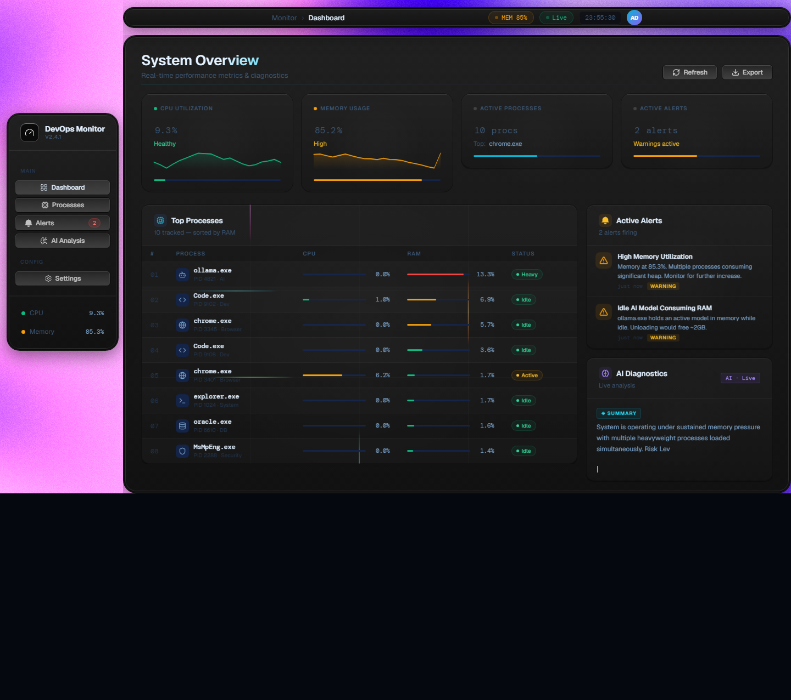
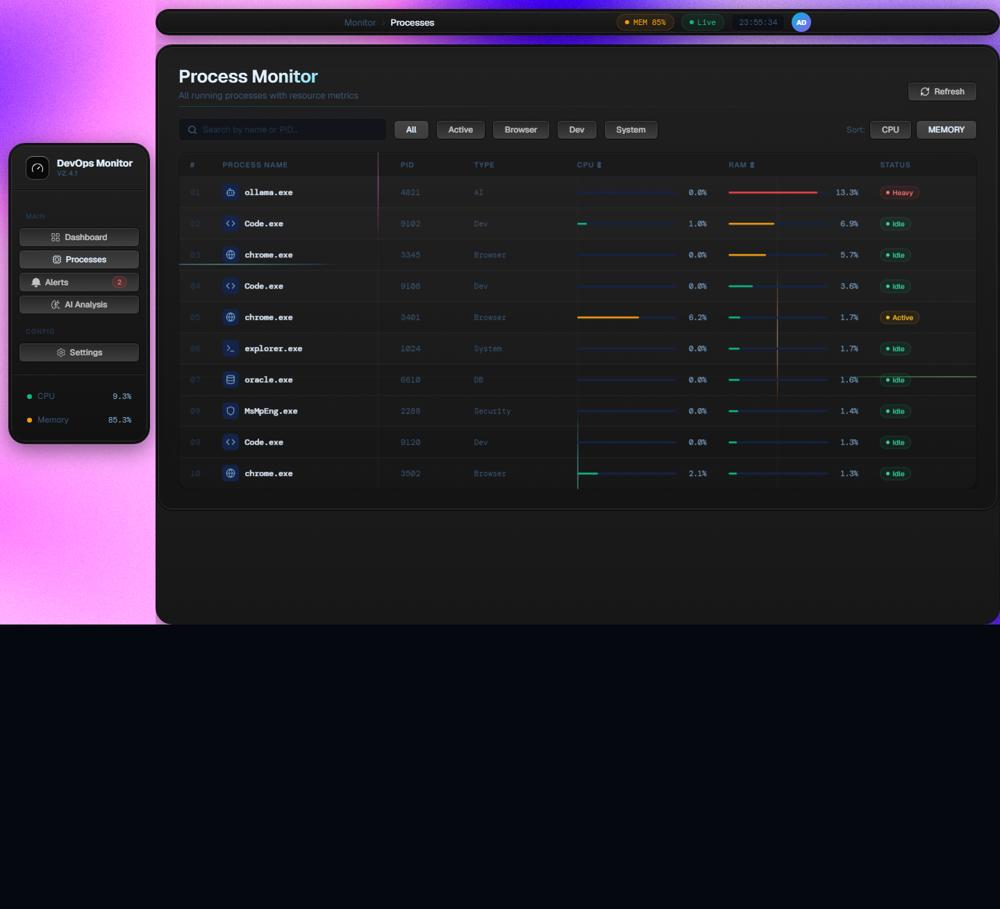
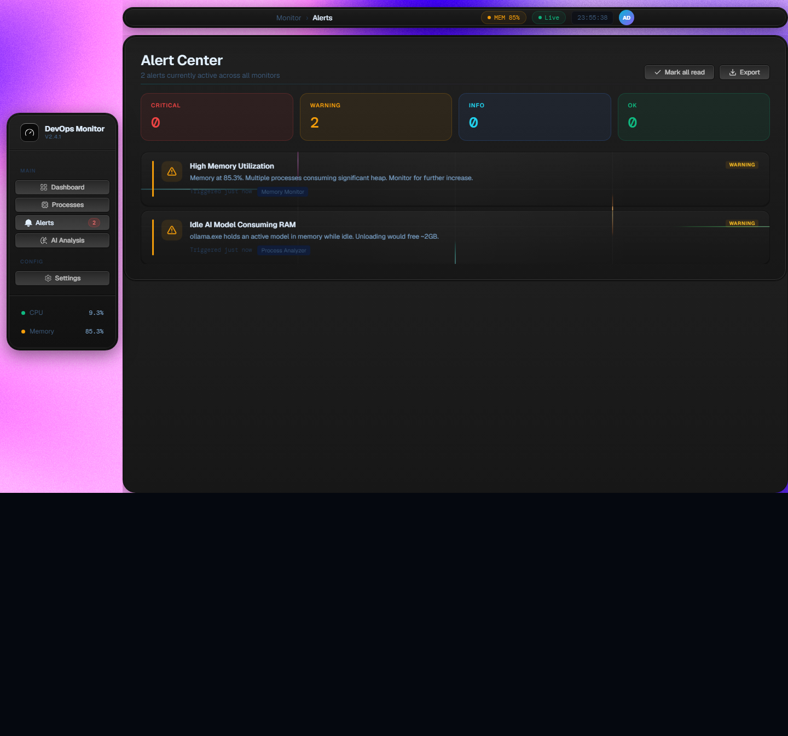
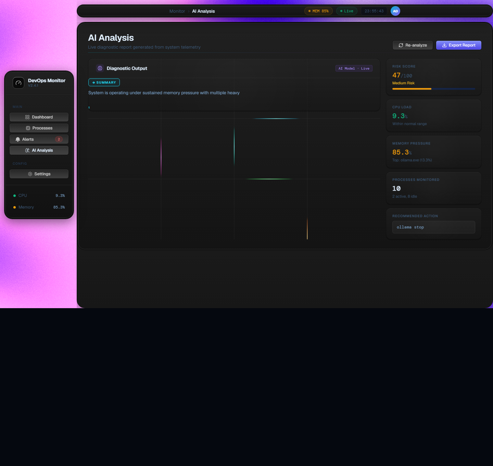

# AI DevOps Monitor


A local system monitoring platform with real-time telemetry and AI analysis. It runs fully on your laptop.

## System Architecture

* **Data Collector:** psutil (Windows OS)
* **Backend:** FastAPI
* **Real-time Streams:** WebSockets
* **Frontend Dashboard:** React
* **AI Engine:** Ollama LLM (Qwen 2.5 1.5B)

## Screenshots

### Main Dashboard


### Process Monitor


### Alert Center


### AI Analysis


## Key Features

### 1. Real-Time Telemetry & Process Intelligence
The system uses WebSockets to stream live data:
* **/ws/metrics**: Tracks CPU usage, memory usage, and timestamp for live system health tracking.
* **/ws/processes**: Tracks process name, CPU usage, and memory usage. It ranks and sorts the top 5 processes based on a weighted score (CPU + memory) to detect heavy applications.

### 2. AI Reasoning Layer
* **/ws/ai**: Collects CPU and memory history, computes averages, extracts top processes, and sends a prompt to the local Qwen model. It returns an analysis to the frontend to explain the system state in natural language and generate recommendations.
* Uses **qwen2.5:1.5b** locally via Ollama with no cloud dependencies.

### 3. Interactive React Dashboard
A live dashboard displaying:
* System metrics (CPU %, Memory %)
* Process list (top memory & CPU consumers)
* AI panel (system summary, risk level, recommendations)

### 4. Alert & Scoring System
* Triggers warnings on the frontend when CPU or Memory exceeds thresholds.
* The AI contributes a risk score (0-100) and powers the recommendation engine.
* Process ranking logic: `score = cpu * 0.6 + memory * 0.4`
* Risk score logic: `risk_score = CPU impact + Memory impact + top process impact`

### 5. Secure Local Traffic
* Enabled HTTPS with OpenSSL self-signed certificates.
* Uvicorn runs a secure server resulting in encrypted local traffic and secure WebSocket upgrades (wss).

## Core Design Decisions

1. **Metric Collection:** Uses `psutil` for direct OS access to CPU/memory metrics without external agents, ensuring offline functionality and low setup cost.
2. **Time Series History:** Keeps a short-term in-memory buffer (last 5 entries) of system snapshots. This reduces memory usage while smoothing out sudden spikes.
3. **Rolling Averages:** Averages the history buffer to remove noise, avoid false alerts, and stabilize the input for the AI model.
4. **Process Scoring & Sorting:** Processes are ranked using a weighted formula (`score = CPU * 0.6 + Memory * 0.4`). This prioritizes CPU spikes (which usually cause lag) while still accounting for persistent memory leaks. The top 5 heavy processes are extracted for analysis.
5. **Structured AI Prompts:** The AI receives a structured prompt containing CPU/Memory averages and the top processes. This ensures consistent responses, easier pattern recognition, and stable outputs.
6. **AI Decision Layer:** The local LLM interprets the raw metrics to provide a human-readable system summary, risk level (0-30: low, 30-70: medium, 70+: high), root causes, and actionable fix suggestions without hardcoding rules.
7. **WebSocket Streaming:** Uses WebSockets for real-time updates without polling overhead, providing a continuous data feed to the frontend.
8. **In-Memory Storage:** The system avoids a persistent database to remain lightweight, fast, and simple. The trade-off is that historical data is lost on restart.

## Real-time Behavior
* **Every cycle:** The backend collects system stats and sends WebSocket updates. The frontend renders the updates instantly.
* **Every 10-15 seconds:** The AI runs to provide continuous dashboard updates.

## System Architecture Diagram

```
                  React Frontend
                         │
                    WebSocket/API
                         │
                   Python Backend
                (FastAPI async server)
                         │
        ┌────────────┼────────────┐
        │            │            │
     Ollama        Tools       Database
   (Qwen 2.5)   Integration
```

## Directory Structure
```
D:\
 ├── ollama\
 │    └── models\
 │
 ├── ai-devops-project\
 │    ├── backend\
 │    ├── frontend\
 │    ├── datasets\
 │    └── logs\
```

## Getting Started / Setup Guide

### 1. Prerequisites
Ensure you have the following installed:
* Python 3.8+
* Node.js & npm
* Ollama
* OpenSSL (for generating local HTTPS certificates)

### 2. Ollama AI Setup
Install Ollama, verify its version, and pull the required model:
```bash
ollama --version
ollama list
ollama pull qwen2.5:1.5b
ollama run qwen2.5:1.5b
```
*(To stop the model if needed, run: `taskkill /IM ollama.exe /F`)*

### 3. Backend Setup (FastAPI)
Open a terminal and navigate to the backend directory:
```bash
cd D:\ai-devops-project\backend

# Create and activate virtual environment
py -m venv venv
venv\Scripts\activate

# Install dependencies
python -m pip install --upgrade pip
python -m pip install fastapi[all] uvicorn ollama psutil websockets httpx

# Generate SSL certificate for secure WebSocket traffic
openssl req -x509 -newkey rsa:2048 -nodes -keyout key.pem -out cert.pem -days 365

# Run the backend server with HTTPS
python -m uvicorn main:app --host 0.0.0.0 --port 8000 --ssl-keyfile=key.pem --ssl-certfile=cert.pem
```

### 4. Frontend Setup (React/Vite)
Open another terminal:
```bash
cd D:\ai-devops-project\frontend

# Install dependencies
npm install

# Run the frontend server
npm run dev
```

### 5. Helpful Debugging Commands
* Check running processes: `tasklist`
* Check port 8000 usage: `netstat -ano | findstr :8000`
* Kill a process by PID: `taskkill /PID <pid> /F`

## What this project represents
This is a simplified DevOps observability system:
* Like **Datadog agent** (metrics)
* Like **Prometheus exporter** (process stats)
* Like **Grafana dashboard** (UI)
* Plus an **AI layer** (insights engine)

## What this system is NOT yet
* No distributed monitoring
* No persistent database
* No authentication layer
* No multi-machine tracking
* No event-driven architecture

## Future Work: Multi-Agent Tool Calling Architecture

As the project evolves, the next major feature will be migrating to an **AI Orchestrator with Multi-Agent Tool Calling** (leveraging advanced models like Gemma 4). 

Instead of a single LLM evaluating everything, the architecture will be upgraded to a primary intent-parsing AI that dynamically routes requests to individual, specialized trained AI models acting as tools.

### The Vision
Similar to how you might ask a voice assistant:
> *"Hey AI, what's the score?"* → Routes to a **Score Predictor AI Tool**
> *"Hey AI, is it going to rain?"* → Routes to a **Weather Predictor AI Tool**

**In our AI DevOps Monitor, it will look like this:**
> *"Hey AI, why is the server lagging?"* 
> 1. **Primary Orchestrator AI** analyzes the natural language prompt.
> 2. It determines which tools are needed and selects the **Anomaly Detection AI Tool** and the **Log Analyzer AI Tool**.
> 3. The specialized models run their predictions.
> 4. The primary AI synthesizes their outputs to provide a comprehensive fix.

### Proposed Tool Suite
Each "tool" will be its own individually trained ML/AI model with a narrow, specific purpose:
* **Log Analysis AI:** Trained specifically to parse application logs and find stack traces.
* **Network Traffic Predictor AI:** Forecasts bandwidth spikes and usage trends.
* **Process Anomaly AI:** Analyzes memory/CPU behavior to detect exact signatures of memory leaks.
* **Command Execution AI:** A sandboxed tool that safely generates and executes OS-level commands (e.g., dynamically altering limits or safely killing rogue processes).

This structure will enable seamless, natural language tool-calling where the main AI delegates tasks to specialized micro-models, drastically improving accuracy and system reliability.
